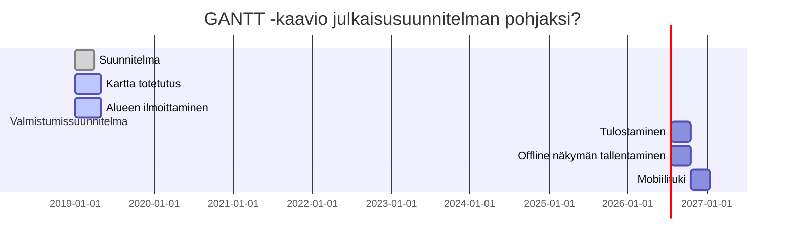

Ohjelmiston/palvelun vaatimusmäärittely

# TTOS0100 Kurssin harjoitustyö HT1 - TA-2019-1


* M3286
* 2019 
* Versionumero 0.95


## Sisällysluettelo 

* [Tuotteen kuvaus](#Johdatus)
* [Palvelukuvaus](#Palvelukuvaus)
* [Asiakastarina](#Valitut-asiakastarinat)
* [Sidosryhmät ja profiilikuvaukset](#Tunnistetut-sidosryhmäkuvaukset-(Stakeholders))
* [Sidosryhmäkuva](#sidosryhmäkuva)
* [Palvelu/asiakaspolku](#asiakaspolku)
* [Yleinen käyttötapaus](#käyttötapaus)
* [Yleiset toiminnalliset vaatimukset](#funkkis)
* [Yleiset ei-toiminnalliset vaatimukset](#nonfunk)
* [Palvelu MockUp](#mock)
* [Tärkeimmät ominaisuudet](#omiomi)
* [Alustavat User Story -tapaukset](#userstor)
* [Julkaisun suunnitelma](#julkkari)
* [Palvelun/ohjelmiston arkkitehtuuri](#arkki)
* [Testaus ja laadunvarmistus]()
* [Lähteet]()

<a name="Johdatus"></a>
# Johdatus

Retkipalvelun on tarkoitus hankkia Internet-karttapalvelun kehitystö ja sen luoma karttapalvelu. Nykyiisn käytössä oleva karttapalvelu uudistetaan kokonaan tässä hankkeessa. Hankinta koostuu kahdesta osasta, karttapalvelun toteutuksesta ja käyttöpalvelusta. 
Ensimmäinen osa on projekti, jossa toimittajalta hankitaan mm. karttapalvelun määrittelyyn, kehittämiseen, toteuttamiseen ja käyttöönottoon kuuluvat palvelut. Karttapalvelu toteutetaan toimittajan ylläpitämään ympäristöön. Kehitystyö tehdään näppärää ohjelmistokehitysmenetelmää käyttäen.
Toinen osa on karttapalvelun käyttö-, ylläpito ja aineistopalvelu, jota tuotetaan jatkuvana palveluna toimittajan paikkatietopalvelimelta osaksi retkipalvleun loppukäyttäjilleen tuottamia palveluita.

## Vaatimusmäärittelytyön tilaaja

Virallinen nimi: Narsunretkipavelut<br>
Kansallinen yritys- ja yhteisötunnus:	1234567-8<br>
Postiosoite:	PL 123456<br>
Postinumero:	12345 <br>
Postitoimipaikka:	Yli-Narsu <br>
Maa:	Suomi <br>
Yhteyshenkilö:	Yrjö Yhteyshenkilö <br>
Puhelin:	+358 11223344 <br>
Sähköpostiosoite:	yka@narsu.se <br>
NUTS-koodi:	Sysi-Suomi (FI99) <br>
Pääasiallinen osoite: (URL)	http://www.narsu.se/man <br>

## Vaatimusmäärittelyn toimittaja

Tieto- ja viestintätekniikan tuleva ammattilainen.<br>
Edustama yritys/yhdistys: JAMK (Jyväskylän Ammattikorkeakoulu) <br>
Postiosoite: Piippukatu 2 <br>
Postinumero: 40100 <br>
Postitoimipaikka: Jyväskylä <br>
Maa: Suomi <br>
Yhteyshenkilö: Joonatan Ovaska <br>
Puhelin:    +358 11223344 <br>
Sähköpostiosoite:   yka@narsu.se <br>
NUTS-koodi: Keski-Suomi (FI4) <br>
Pääasiallinen osoite: (URL) http://www.esimerkki.osoite.fi <br>

<a name="Palvelukuvaus"></a>
# Palvelukuvaus

Karttapalvelu näyttää matkapalvelun ja muutamien ulkopuolisten tiedontuottajien paikkatietoa maastokartan ja muiden taustakarttojen sekä ilmakuvien päällä. Matkakartta näyttää Retkipalvelun paikkatietoja, jotka poimitaan Narsunmatkapalvelunhallituksen paikkatietojärjestelmästä. Näitä aineistoja ovat esim. suojelualueet ja retkeilykohteet, retkeilyn palveluvarustus ja retkeilyreitit sekä kalastus- ja metsästyskohteet.

Palvelusta löydetään alueita, joiden tarkemmat yksityiskohdat löytyvät palveluiden tuottajien omilta sivuilta.

<a name="Valitut-asiakastarinat"></a>
## Valitut asiakastarinat

A: Kaupunkilaispoika kaipaa luontoa aika-ajoin ja selvittää palvelusta kalastus ja retkeilykohteita kesälomaansa varten. Käyttäjä löytää alueet ja alueisiin liittyvät tiedot sivuilta ja pystyy valmisteleen reissunsa tämän ympärille. Käyttäjä toivoo pystyvänsä saamaan ja käyttämään tietoa täysin sähköisessä muodossa, asiakas haluaa tallentaa offline kartan palvelusta, sekä saada helposti selville lähimmän pysäköintipaikan autolle. Käyttäjä palaa palveluun seuraavissa reissuissansa.


B: Metsästysharrastelija kaipaa vaihtelevia ympäristöjä ja haluaa viedä koirat ja lapsensa mukaan metsästys-, kalastus- ja retkeilyreissuille. Käyttäjä myös myy osan metsästämistään lihoista ja nahoista eteenpäin. Käyttäjän on tärkeätä pystyä tutustumaan maastokarttaan hyvissä ajoin ennakkoon, jotta voisi suunnittella reitin valmiiksi. 


C: Kunta tai yksityinenhenkilö haluaa rakentaa uuden retkeily, metsästys ja kalastusalueen palveluun. Käyttäjä ilmoittaa omistamansa alueet ja ilmoittaa ne ylläpidolle koordinaatteineen. Ylläpitäjä varmistaa tiedon oikeelliseksi valtion tietokannoista ja lähettää ilmoittajalle vahvistuksen tietojen oikeellisuudesta, jonka tarkastamisen jälkeen paikka julkaistaan palvelussa.


<a name="sidosryhmäkuva"></a>
## Yleinen sidosryhmäkuva (Stakeholder map)


<a name="Tunnistetut-sidosryhmäkuvaukset-(Stakeholders)"></a>
## Tunnistetut sidosryhmäkuvaukset (Stakeholders) 

* [Profile 1 - Peruskäyttäjä](../Profiilikuvaus_1.md)
* [Profile 2 - Aktiivikäyttäjä](../Profiilikuvaus_2.md)
* [Profile 3 - Kunta tai alueen omistaja](../Profiilikuvaus_3.md)
* [Profile 4 - Ylläpitäjä](../Profiilikuvaus_4.md)
* [Profile 5 - Kehittäjä](../Profiilikuvaus_5.md)
* [Profile 6 - Ulkomaalainen käyttäjä](../Profiilikuvaus_6.md)

<a name="asiakaspolku"></a>
## Palvelu/asiakaspolku (Customer Journey/Path)

Käyttäjä avaa sivuston joko tietokoneellaan tai mobiililaitteella. Mobiililaitteeseen saatavilla myös applikaatio joka mahdollistaa mm. offline karttojen tallentamisen.

[]

[]

Käyttäjä [Profile 2 - Aktiivikäyttäjä](../Profiilikuvaus_2.md) havahtuu, että hirvenmetsästyskausi on alkamassa ja lapset ovat sopivasti lomalla. Käyttäjä selvittää palvelusta,
missä olisi hyvät retkeilymaastot ja hirvenmetsästys metsää. Asiakkaalla on jo padit haulikossa ja metsästysmieli kaakossa. Asiakas avaa sivuston ja valitsee haluamansa kohteen,
hitaalla tietokoneellaan asiakas löytää sivustolle ja tulostaa valmiiksi alueen kartan, jotta tietää mikä kuuluu alueeseen ja osaa tarvittaessa suunnistaa alueella.

Käyttäjä [Profile 1 - Peruskäyttäjä](../Profiilikuvaus_1.md) haluaa lähteä lappiin tutkimaan luontoa ja heittämään vähän vapaa. Ei muutakuin matkapuhelin kouraan ja
valmistaudutaan reissuun. Asiakas etsii matkapuhelimellaan sopivan kohteen ja varautuu siihen ettei kohteessa matkapuhelin kuulu tai verkko on hidas. Asiakas tallentaa
kartaston offline kartaksi näppärästi applikaation avuin ja täten saa haluamansa kohteen tiedot ja kartat matkapuhelimestansa auki vaikkei internetyhteyttä pystyisikään
muodostamaan ison tunturin kupeessa.


# Vaatimukset, käyttötapaukset ja ominaisuudet
<a name="nonfunk"></a>
## Tuotteen järjestelmävaatimukset ja mahdolliset rajoitukset (Key Requirements and restrictions)

Palvelun on pystyttävä toimimaan heikommillakin laitteilla, palvelusta on selvittävä selkeästi metsä, retkeily ja kalastusalueet. Palvelua tulee olla vaivatonta ylläpitää.
Palvelun tulee olla helposti löydettävissä ja sitä on oltava helppo käyttää.

| VaatimusID | Tyyppi | Kuvaus | Ominaisuus johon vaikuttaa |								
|:-:|:-:|:-:|:-:|
| SYSTEM-REQ-0001 | System Requirement | Palveluiden on toimittava hitailla yhteyksillä |  |
| SYSTEM-REQ-0002 | System Requirement | Sivusto täytyy olla vähintään kahdella kohdetietokoneella, jos toinen pettää | |
| SYSTEM-REQ-0003 | System Requirement | Palvelun tulee tunnistaa mobiililaite ja ehdottaa mobiiliversiota kyseisissä tapauksissa ||
| SYSTEM-REQ-0004 | System Requirement | Mobiililaitteissa täytyy olla tuki heikommillekin älypuhelimille ||
| SYSTEM-REQ-0005 | System Requirement | Tulostusversio kartasta on oltava yleisimmille tulostimille ainakin A5, A4 ja A3 paperituki | [Ominaisuus 3 - Tulostaminen](../Ominaisuus 3.md) |
| SYSTEM-REQ-0006 | System Requirement | Mobiilissa karttakuvat ja tiedot on pystyttävä tallentamaan offline tilaan ||
| SYSTEM-REQ-0007 | System Requirement | Offline kartat tulee olla yleisimmän formaatin tukevia PDF tai applikaation oma käyttöformaatti ||


# Oleelliset huomioitavat rajoitteet

| Id | Vaatimuksen kuvaus | kategoria | Vastuullinen |
|:-:|:-:|:-:|:-:|
| CONSTRAINT-REQ-S00000 | Constrain | Karttapalvelu toimii vain kotimaan raja-alueella  |  |
| CONSTRAINT-REQ-S00001 | Constrain | Suomenlaki sanoo, että karttapalvelussa saa käyttää vain tiettyä tarkkuutta ||
| CONSTRAINT-REQ-S00002 | Constrain | Normaalikäyttäjä saattaa olla tietoteknisesti heikompi tasoinen ||
| CONSTRAINT-REQ-S00003 | Constrain | Tulostuspainike pitää luoda erikseen selkeyttämään käyttöä ||


<a name="käyttötapaus"></a>
## Tärkeimmät käyttötapaukset (General Use Cases)

Käyttötapauksista tyypillisimmät ovat, kun käyttäjä löytää palvelusta alueen jonne haluaa lähteä retkelle ja toinen yleinen käyttö on kun maanomistaja ilmoittaa palveluun
alueensa käytettäväksi. Molemmissa tapauksissa ylläpito on osallisena tietojen oikeudellisuudesta.

**Esimerkit**

* [Käyttötapaus 1 - Asiakas löytää kohteen](usecase.md)
* [Käyttötapaus 2 - Alueen omistaja ilmoittaa alueen](usecase2.md)


```plantuml
left to right direction
skinparam packageStyle rectangle
actor Alueenomistaja
actor Ylläpito
actor Viranomainen
rectangle Alueenlisäys {
  Alueenomistaja -- (Alueenlisäys)
  (Alueenlisäys) .> (Koordinaatit)
  (Koordinaatit) .> (Alueenreunukset)
  (Alueenlisäys) .> (Omistussuhteen todentaminen)
  (Koordinaatit) -- Ylläpito
  (Alueenreunukset) -- Ylläpito
  (Omistussuhteen todentaminen) -- Viranomainen
}
```

<a name="funkkis"></a>
## Palveluun liittyvät tärkeimmät toiminnalliset vaatimukset (Functional Requirements)

Palvelun tulee olla mahdollisimman yksinkertainen ja soveltuvainen jokaiselle graafiselle laitteelle. Optimoinnit erikseen mobiililaitteille ja työpöytälaitteille. Käyttö, tallentaminen ja tulostaminen tulisi olla mahdollista kaikilla laitteilla. Huomioon tulee ottaa yleisimmät selaimet, sekä mobiili- että työpöytälaitteiden maailmassa, myös rinnakkais käyttöliittymien suosimat versiot kuten: Safari, Google, Microsoft edge.

| VaatimusID | Tyyppi | Kuvaus | Ominaisuus johon vaikuttaa |								
|:-:|:-:|:-:|:-:|
| FUNCTIONAL-REQ-C0001 | Functional Requirement | Sivusto toimii android mobiililaitteella | [Ominaisuus 1 - Alueen löytäminen](../Ominaisuus 1.md) |
| FUNCTIONAL-REQ-C0002 | Functional Requirement | Sivusto toimii ios mobiililaitteella | [Ominaisuus 1 - Alueen löytäminen](../Ominaisuus 1.md) |
| FUNCTIONAL-REQ-C0003 | Functional Requirement | Sivusto toimii windows, linux ja mac laitteella | [Ominaisuus 1 - Alueen löytäminen](../Ominaisuus 1.md) |
| FUNCTIONAL-REQ-C0004 | Functional Requirement | Sivuston tulostaminen skaalautuu tulostomille näkymän mukaisesti ||
| FUNCTIONAL-REQ-C0005 | Functional Requirement | Tulostaminen mahdollista erilaisille paperikokoluokille A4,A5,US Letter | [Ominaisuus 3 - Tulostaminen](../Ominaisuus 3.md) |
| FUNCTIONAL-REQ-C0006 | Functional Requirement | Näkymän tallentaminen toimii kaikissa laitteissa | [Ominaisuus 4 - Offline näkymän tallentaminen](../Ominaisuus 4.md) |
| FUNCTIONAL-REQ-C0007 | Functional Requirement | Applikaatio tukee omaa tallennusformaattia, sekä yleisimmin tuettuja formaatteja esim. PDF, PNG, JPG ||
| FUNCTIONAL-REQ-C0008 | Functional Requirement | Tulostuksen sijaan voidaan tallentaa myös pöytäkoneella yleisimmin tuettuja formaatteja | [Ominaisuus 4 - Offline näkymän tallentaminen](../Ominaisuus 4.md) |
| FUNCTIONAL-REQ-C0009 | Functional Requirement | Sivuston käyttö tulee olla yksinappista ||
| FUNCTIONAL-REQ-C0010 | Functional Requirement | Zoomaus tulee toimia myös napista painamalla, eikä vain esim. skrollaamalla ||
| FUNCTIONAL-REQ-C0011 | Functional Requirement | Palvelusta voi hakea hakusanoilla alueita ||
| FUNCTIONAL-REQ-C0012 | Functional Requirement | Palvelussa voi kytkeä kaikki alueet näkyviin ||
| FUNCTIONAL-REQ-C0013 | Functional Requirement | Alueen omistaja voi ilmoittaa omistamansa alueen palvelun ylläpitäjälle | [Ominaisuus 2 - Alueen ilmoittaminen](../Ominaisuus 2.md) |


## Palveluun liittyvät tärkeimmät ei-toiminnalliset vaatimukset (Non Functional Requirements)

Palveluun liittyy paljon ei-toiminnallisia vaatimuksia, eriteltyinä suorituskykyyn, tietoturvaan, käytettävyyteen ja testattavuuteen. Kyseiset ominaisuudet määritelty alla olevissa aliotsikoissa

Tärkeimmät ei-toiminnalliset vaatimukset ovat helppokäyttöisyys ja tuki mahdollisimman monelle käyttäjälle ja laitteelle.

### Suorituskyky? (Performance)

Suorituskyky tulee olla isossa prioriteetissa, kartan ei tule olla turhan raskas latautumaan vaan kartta on oltava mahdollisimman kevyt käyttöinen, jotta hitaimmillakin laitteilla käyttö olisi mahdollisimman sulavaa.


| VaatimusID | Tyyppi | Kuvaus | Ominaisuus johon vaikuttaa |								
|:-:|:-:|:-:|:-:|
| PERFORMANCE-REQ-0000 | Non-Functional Performance | Sivusto tulee olla käytettävissä 1000:lla käyttäjällä samanaikaisesti |  |								
| PERFORMANCE-REQ-0001 | Non-Functional Performance | Sivuston tulee olla mahdollisimman kevyt, sekä dataliikenteen näkökulmasta ||
| PERFORMANCE-REQ-0002 | Non-Functional Performance | Käytettävyys tulee olla suunntattu silmällä pitäen myös tietoteknisesti heikompia käyttäjiä varten ||
| PERFORMANCE-REQ-0003 | Non-Functional Performance | Sivuston on oltava mahdollisimman kevyt suorituskyvyn näkökulmasta ||
| PERFORMANCE-REQ-0004 | Non-Functional Performance | Sivustoa on pystyttävä käyttää myös värisokeasti tarvittaessa (harmaasävyt) ||


### Tietoturva?

Ylläpidolliset asiat on pystyttävä varmentamaan siten ettei sivustolle eksy väärää tietoa. Sivusto ja applikaatio ei pyydä kirjautumistietoja, joten käyttäjien tiedot eivät ole vaarassa.

| VaatimusID | Tyyppi | Kuvaus | Ominaisuus johon vaikuttaa |								
|:-:|:-:|:-:|:-:|
| SECURITY-REQ-0001 | Non-Functional Security | Ei pyydetä sisäänkirjausta käyttäjiltä | |								
| SECURITY-REQ-0002 | Non-Functional Security | Ylläpidon pystyttävä ottamaan palvelinkoneeseen yhteys turvallisesti etänä ||
| SECURITY-REQ-0003 | Non-Functional Security | Palvelinyhteys otetaan eri sivuston kautta, jotta sen "nuuskiminen" hankaloituu ||
| SECURITY-REQ-0004 | Non-Functional Security | Karttapalvelu toimii aina kahdella eri palvelin koneella samanaikaisesti ja ylläpito päivittää vain yhtä konetta ||
| SECURITY-REQ-0005 | Non-Functional Security | Varmuuskopio karttasivustosta on sekä pilvessä, kehittäjällä että ylläpitäjällä samanaikaisesti ||
| SECURITY-REQ-0006 | Non-Functional Security | Palvelun ostajalle lähtee aina kopio vanhasta kartasta, kun uusi syötetään, mahdollisen ylläpitotunnusten aiheuttaman tahallisen pahanteon poiskytkemiseksi ||

### Käytettävyys

Käytettävyys tulee olla mahdollisimman yksinkertainen ja helppo vähän tietokoneita ja laitteita käyttäneiden keskuudessa

| VaatimusID | Tyyppi | Kuvaus | Ominaisuus johon vaikuttaa |								
|:-:|:-:|:-:|:-:|
| USABILITY-REQ-0000 | Non-Functional Usability | Käyttöliittymän täytyy olla harmaaskaalattu, jotta se soveltuu värisokeille | | |	
| USABILITY-REQ-0001 | Non-Functional Usability | Käyttöliittymän tulee toimia yksinappisesti, jotta sitä voi käyttää kaikilla laitteilla samanlaisesti ||
| USABILITY-REQ-0002 | Non-Functional Usability | Tulostuksen tulee olla mahdollisimman yksinkertaista ja ruudunkaappaus on saatava siitä näkymästä mitä asiakas näkee | [Ominaisuus 3 - Tulostaminen](../Ominaisuus 3.md) &  [Ominaisuus 4 - Offline näkymän tallentaminen](../Ominaisuus 4.md) |

### Testattavuus

| VaatimusID | Tyyppi | Kuvaus | Ominaisuus johon vaikuttaa |								
|:-:|:-:|:-:|:-:|
| TESTABILITY-REQ-0000 | Non-Functional Testability | Linux, mozilla  | 	 |	
| TESTABILITY-REQ-0001 | Non-Functional Testability | Windows, microsoft edge ja google chrome ||	
| TESTABILITY-REQ-0002 | Non-Functional Testability | Mac, safari ||	
| TESTABILITY-REQ-0003 | Non-Functional Testability | Android, google chrome ||	
| TESTABILITY-REQ-0004 | Non-Functional Testability | iOS, Safari ||	
| TESTABILITY-REQ-0005 | Non-Functional Testability | Muut selaimet: Opera, internet explorer ||

<a name="mock"></a>
## Palvelu MockUp-prototyyppi

Prototyyppi näyttää kalastusmahdollisuuden valikot ja perusnäkymän puhelimenkäyttöliittymästä, linkki prototyyppiin painamalla kuvasta.

[](https://www.figma.com/proto/FDrknmXGVfuvvPDDc1QU2iLG/Narsunretkipalvelu?node-id=1%3A2&scaling=scale-down "")

<a name="omiomi"></a>
## Tärkeimmät tunnistetut ominaisuudet/piirteet (Features)

Tärkeimmät ominaisuudet ovat alueiden löytämiseen ja tunnistamiseen liittyvät toiminnot. Toisena tärkeänä tulee uusien aluiden ilmoittamistoiminto. Nice to have toiminnot ovat tulostustoiminnot ja tallennustoiminnot offline tilaa varten.

| Ominaisuus | Prioriteetti | Muuta |
| :-: | :-: | :-: |
| [Alueen löytäminen](../Ominaisuus 1.md) | Pakollinen | |
| [Alueen ilmoittaminen](../Ominaisuus 2.md) | Tärkeä | |
| [Tulostaminen](../Ominaisuus 3.md) | Nice to Have | |
| [Offline näkymän tallentaminen](../Ominaisuus 4.md) | Nice to Have | |
| Mobiilituki | Nice to Have | |

<a name="userstor"></a>
## Alustavat User Story -kuvaukset

| Id | Kuvaus | Ominaisuus johon vaikuttaa |
|:-:|:-:|:-:|
| User-01 | Käyttäjänä haluan, että voin löytää etsimäni alueet vaivattomasti | [Alueen löytäminen](../Ominaisuus 1.md) |
| User-02 | Käyttäjänä haluan, että saan tiedot tarvittavista luvista suoraan hakupalvelun kautta | [Alueen löytäminen](../Ominaisuus 1.md) |
| User-03 | Käyttäjänä haluan pystyä kytkemään päälle kaikki kartalla näkyvät kohteet selatakseni tiettyjä alueita | [Alueen löytäminen](../Ominaisuus 1.md) |
| User-04 | Alueen omistajana haluan, että voin ilmoittaa omistamani alueet vaivattomasti | [Alueen ilmoittaminen](../Ominaisuus 2.md) |
| User-05 | Käyttäjänä haluan, että voin tulostaa karttaversion mukaani kun lähden retkelle, ei tarvitse olla mobiililaitteen varassa mahdollisen huonon kuuluvuudenkaan takia | [Tulostaminen](../Ominaisuus 3.md) |
| User-06 | Käyttäjänä haluan, että tulostus on yksinkertaista ja vaivatonta ja että saan sellaisen näkymän tulosteena kuin minulla on ruudullakin | [Tulostaminen](../Ominaisuus 3.md) |
| User-07 | Käyttäjänä haluan, että voin tallentaa karttanäkymän offline tilaan, jotta tarvittaessa huonon nettiyhteyden takia voi selata karttaa retkellä | [Offline näkymän tallentaminen](../Ominaisuus 4.md) |
| User-08 | Käyttäjänä haluan, voida tallentaa karttanäkymän joko sellaisenaan tai applikaation kautta, jolloin seuraaminen onnistuu kuten karttaohjelmassa muutenkin onnistuisi | [Offline näkymän tallentaminen](..Ominaisuus 4.md) |
| User-09 | Käyttäjänä haluan pystyä käyttämään palvelua mobiililaitteella, sille optimoidussa tilassa | Mobiilituki |
| User-10 | Käyttäjänä haluan pystyä käyttämään palvelua sitä varten toteutetulla käynnykkä sovelluksella | Mobiilituki |


## Hyväksyntätestit

| VaatimusID | Testitapaus | Kuvaus |  |								
|:-:|:-:|:-:|:-:|
| FUNCTIONAL-REQ-C0003,FUNCTIONAL-REQ-C0005,USECASE-01, OMINAISUUS-01 | [Test Case Id X](../Hyväksyntätesti 1.md) | Hyväksyntätesti  |
| FUNCTIONAL-REQ-C0013,USECASE-02,OMINAISUUS-02 | [Test Case Id Y](../Hyväksyntätesti 2.md) | Hyväksyntätesti  |
| FUNCTIONAL-REQ-C0004,USECASE-01,OMINAISUUS-03 | [Test Case Id Z](../Hyväksyntätesti 3.md) | Hyväksyntätesti  |
| FUNCTIONAL-REQ-C0004,USECASE-01,OMINAISUUS-04 | [Test Case Id Q](../Hyväksyntätesti 4.md) | Hyväksyntätesti  |
| FUNCTIONAL-REQ-C0001,FUNCTIONAL-REQ-C0002,USECASE-01, OMINAISUUS-05 | [Test Case Id W](../Hyväksyntätesti 5.md) | Hyväksyntätesti  |

<a name="julkkari"></a>
## Julkaisun suunnitelma

Perinteinen listaus

| Aika + Ominaisuuus | Kuvaus | Vastuu | Prioriteetti |
|:-:|:-:|:-:|:-:|
| 1.5.2020 [Alueen löytäminen](../Ominaisuus 1.md) | Alueen hakutoiminto | Pakollinen |
| 1.6.2020 [Alueen ilmoittaminen](../Ominaisuus 2.md) | Alueen ilmoitustoiminto | Tärkeä |
| 8.9.2020 [Tulostaminen](../Ominaisuus 3.md) | Tulostamistoiminto | Nice to have |
| 8.9.2020 [Offline näkymän tallentaminen](../Ominaisuus 4.md) | Näkymän tallentamis toiminto | Nice to have |
| 12.12.2020 [Mobiilituki](../Ominaisuus 5.md) | Mobiililaitetuki | Nice to have |


Tutustu Mermaid skriptiin?




# Palvelun/ohjelmiston arkkitehtuuri 

<a name="arkki"></a>
### Yleinen sijoittelunäkymä (Deployment diagram )

[](https://gitlab.labranet.jamk.fi/ttos0100-kurssi-2019/kurssi-ttos0100/raw/master/dokumentit/02-vaatimusmaarittely/kuvat/DeploymentDiagram.PNG "")

# Arkkitehtuuriin/teknologiaan liityvät vaatimukset

[](https://gitlab.labranet.jamk.fi/ttos0100-kurssi-2019/kurssi-ttos0100/raw/master/dokumentit/02-vaatimusmaarittely/kuvat/Class_diagram.png "")

<!--
### Tekniset vaatimukset 

| Id | Vaatimuksen kuvaus | kategoria | Vastuullinen |
|:-:|:-:|:-:|:-:|
| REQ00x | Vaatimus? | Yllläpito | Kuka vastaa | 
| REQ00x | Vaatimus? | Tekninen | Kuka vastaa | 
| REQ00x | Vaatimus? | Käytettävyys | Kuka vastaa | 
| REQ00x | Vaatimus? | Käytettävyys | Kuka vastaa | 
| REQ00x | Vaatimus? | Käytettävyys | Kuka vastaa | 

### Ylläpito (Maintenance)

_Tähän kirjataan vaatimuksia, joiden merkitys tulee esiin vasta tuotteen julkaisun jälkeen. Miten tuotteen ylläpidettävyyttä parannetaan? Mitä pitää ottaa huomioon, että ylläpidettävyys on helpompaa__

| Id | Vaatimuksen kuvaus | kategoria | Vastuullinen |
|:-:|:-:|:-:|:-:|
| REQ00x | Vaatimus? | Yllläpito | Kuka vastaa | 
| REQ00x | Vaatimus? | Tekninen | Kuka vastaa | 
| REQ00x | Vaatimus? | Käytettävyys | Kuka vastaa | 
| REQ00x | Vaatimus? | Käytettävyys | Kuka vastaa | 
| REQ00x | Vaatimus? | Käytettävyys | Kuka vastaa | 

### Tietokantakuvaus (Database ER-diagram)

 Tähän esim alustava __ER-kaavio__

# Testauksen vaatimukset (Testing requirements)

### Testattavuus

| Id | Vaatimuksen kuvaus | kategoria | Vastuullinen |
|:-:|:-:|:-:|:-:|
| REQ00x | Vaatimus? | Testattavuus | Kuka vastaa | 
| REQ00x | Vaatimus? | Testattavuus | Kuka vastaa | 
| REQ00x | Vaatimus? | Testattavuus | Kuka vastaa | 
| REQ00x | Vaatimus? | Testattavuus | Kuka vastaa | 
| REQ00x | Vaatimus? | Testattavuus | Kuka vastaa | 


# Tunnistetut riskit ja testikohteet

* Riski -> Testaustarve
* Vaatimus -> Testaustarve


### Kaikki vaatimukset listattuna

**Tähän osaan voidaan linkittää vaatimuslista, josta kaikki tunnistetut vaatimukset löytyvät**

* [Linkki vaatimuslistaan](pohjat/vaatimuslista.md)


### Dokumentit, standardit ja lähteet

qui dolorem ipsum quia dolor sit amet, consectetur, adipisci velit, sed quia non numquam eius modi tempora 
incidunt ut labore et dolore magnam aliquam quaerat voluptatem. Ut enim ad minima veniam, 
quis nostrum exercitationem ullam corporis suscipit laboriosam, nisi ut aliquid ex ea commodi consequatur?

*Lähteet/Standardit/Suositukset*

| ID | Linkki |  |  
|:-:|:-:|:-:|
| JHS 165 ICT | http://www.jhs-suositukset.fi/c/document_library/get_file?uuid=b8118ad7-8ee4-459a-a12b-f56655e4ab9d&groupId=14 | Vaatimusmäärittely |
| SO 9241-11 | https://fi.wikipedia.org/wiki/K%C3%A4ytett%C3%A4vyys  | Käytettävyys | 
| ISO9001 | https://www.sfs.fi/julkaisut_ja_palvelut/tuotteet_valokeilassa/iso_9000_laadunhallinta/iso_9001_2015  | - | 
| - | -  | - | 
-->